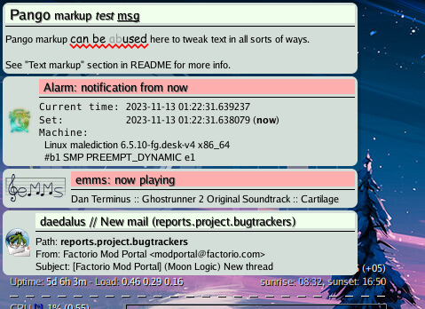

notification-thing
--------------------

Gtk3/Python (PyGI) notification daemon with flexible (scriptable) filtering,
rate-limiting and misc other features, for linux desktop, not tied to any
particular desktop environment.

Features:

* Implements [Desktop Notification spec](https://specifications.freedesktop.org/notification-spec/latest/)
  (current version 1.2).

  Should be compatible with any dbus clients (e.g. libnotify, Gtk3, etc).
  Supports icons and resizing of these (to a fixed/min/max box).

* Tries hard to never drop any notifications silently by itself, even in case of
  any unexpected errors.

* [Pango markup](https://docs.gtk.org/Pango/pango_markup.html)
  support in notification summary and body, option to enable/disable that for
  individual messages via notification parameters, broken-markup-safe.
  Start the thing with --test-message option to see how it works.

* Configurable appearance via
  [Gtk3 styles](https://docs.gtk.org/gtk3/css-overview.html)
  (simple css files) and themes.

* Rate-limiting using configurable "leaky" token-bucket algorithm.

  When/if several messages get delayed, they will be displayed batched into one
  "digest" message, up to a limit (number of last ones), and dropped with a
  warning line (and a count of these) beyond that.

* D-Bus interface has extra calls to pause passing notifications (but still
  buffering these to "digest"), force-flushing such buffer, displaying previous
  (cleaned-up) notifications, changing/pausing default cleanup timeout, etc.

* Can send/receive json-serialized notifications via
  [ZeroMQ](https://zeromq.org/) pub-sub queues.

  This allows to e.g. link several machines together, to see all notifications
  which are from any of them or send desktop notifications from a remote machine
  (doesn't have to be a desktop one either, see included "notify-net" script and
  zmq message format info below).

* Filtering and matching using simple but very powerful scheme scripting
  (based on [Peter Norvig's lispy2](https://norvig.com/lispy2.html)).

* Can play any sounds from anywhere in the filtering scripts
  (via [libcanberra](https://0pointer.net/lennart/projects/libcanberra/)).

  I.e. only on specific occasions, like some regexp-match, not for every message
  (though that is certainly possible as well), different sounds based on
  notification message, or even multiple samples for the same one.

* Optional logging for notifications with built-in file rotation.

* All options/features are configurable and can be disabled entirely,
  either via command-line options or a YAML configuration file.

* Easy to change and debug - it's just a python script.

See below for detailed description of each particular feature.

Actual notification rendering is inspired (and based in part on)
[notipy](https://gitlab.com/the_isz/notipy) project.

Wrote a few notes on the project a while ago when making it
([link1](https://blog.fraggod.net/2010/2/libnotify-notification-daemon-shortcomings-and-my-solution),
[link2](https://blog.fraggod.net/2010/12/Further-improvements-on-notification-daemon),
[link3](https://blog.fraggod.net/2011/8/Notification-daemon-in-python)), but
these should be mostly summarized in this README anyway.

It's a somewhat old thing dating back to 2010 and python2, but I still use it myself,
so should be supported and work perfectly fine on a reasonably-current linux desktop.

Installation
--------------------

It's a regular package for Python 3.X, but not in pypi, so can be
installed from a checkout with something like this:

    % python setup.py install

[pip](https://pip.pypa.io/) can be used to install it from a repo URL:

    % python -m pip install --user 'git+https://github.com/mk-fg/notification-thing.git#egg=notification-thing'

This will install module to `~/.local/lib/`, use
[venv](https://docs.python.org/3/library/venv.html)
module for a more isolated/portable installation into some custom path.

Alternatively, `./notification-thing` can be run right from the checkout tree,
without any installation.

### Requirements

* [Python 3.X](https://python.org/).

* [GObject-Introspection](https://gi.readthedocs.io/en/latest/)-enabled
  [Gtk+](https://www.gtk.org/) 3.X (including Glib, Pango) and
  [PyGObject](https://pygobject.readthedocs.io/en/latest/).

* [libdbus / dbus-python](https://www.freedesktop.org/wiki/Software/DBusBindings/#libdbuspartofdbus).

  Leftover dep from old python2 days, GDBus GI wrappers should probably provide
  all necessary daemon interfaces as well these days.

* (optional) [PyYAML](https://pyyaml.org/) - to configure daemon via YAML file,
  not CLI (--conf option).

* (optional) [pyzmq](https://pyzmq.readthedocs.io/en/latest/) -
  to broadcast/receive notification messages over zeromq pub/sub sockets.

* (optional) [libcanberra](https://0pointer.net/lennart/projects/libcanberra/) -
  to play sounds (from XDG themes or files).

Note that [libnotify](https://gitlab.gnome.org/GNOME/libnotify) and similar libs
are not needed here - they are used to send the messages, not receive and
display these (latter is the job of notification-daemon, which this thing is).

### Repository URLs

- https://github.com/mk-fg/notification-thing
- https://codeberg.org/mk-fg/notification-thing
- https://fraggod.net/code/git/notification-thing

Usage
--------------------

Make sure nothing else is already listening on the same dbus path/interface and
start the daemon by hand - should work.

Run the script with -h/--help option to get the (rather long) list of all
possible configuration options and tunables.

Alternatively, dbus service file can be installed, so daemon can be started
whenever notifications arrive (and exiting during silence timeouts):

    cp org.freedesktop.Notifications.service /usr/share/dbus-1/services/

Another way would be to start the thing from systemd user session or something
like that, e.g. ~/.xinitrc for older systems.

To enable startup with systemd user session for particular user, run following
from that user's shell:

    mkdir -p ~/.config/systemd/user/
    cp notification-thing.service ~/.config/systemd/user/
    systemctl --user enable notification-thing

Can also start it manually then by `systemctl --user start notification-thing`
command.

"notification-thing.service" systemd unit from the repository makes daemon read
`~/.notification.yaml` configuration file by default, if it exists, so any extra
options to the auto-started daemon instance can be specified there (see below).

Note that both files are just an examples from dev setup, so feel free to tweak
them (e.g. add whatever options, change paths, dependencies, etc) to suit your
setup/distro (and ship adjusted file with the package, no need to pull these
from repository).

##### Configuration

Lots of tunable options are available (run the thing with "--help" option to see
the full list), but all-defaults should be the norm (naturally use defaults myself).

Use --debug option to get a verbose log of all that's happening there, which
decisions are made and based on what data.

[YAML](https://en.wikipedia.org/wiki/YAML) configuration file can be used to
specify a lot of options in a more convenient and brief format, see --conf
option and "notification_thing.example.yaml" config in the repo.

##### Filtering

File ~/.notification_filter (configurable via "--filter-file" option) can be
used to control filtering mechanism at runtime and play sounds where necessary
(see below).

It's the simple scheme script, see
[scheme submodule](https://github.com/mk-fg/notification-thing/blob/master/notification_thing/scheme.py)
or [original Peter Norvig's "lispy2" implementation](https://norvig.com/lispy2.html)
for details.

Global definitions:

- All the basic scheme stuff from lispy2:
  [notification_thing/scheme.py#L164-L173](https://github.com/mk-fg/notification-thing/blob/0e8862c/notification_thing/scheme.py#L164-L173)

- `(~ re msg)` - regexp search.
- `(debug val-1 ...)` - print all arguments to --debug log.
- `(sound-play name)`, `(sound-play-sync name)`, etc -
  play sounds via libcanberra, if available - see note on sounds below.
- `(props key value ...)` - set notification properties, like timeout, icon, hints.

Evaluation of the filter script should return the function which will be called
for each notification and should return either #t or #f verdict value for
whether to display it or not.

Example:

    (define-macro define-matcher (lambda
      (name op comp last rev-args)
      `(define ,name (lambda args
        (if (= (length args) 1) ,last
          (let ((atom (car args)) (args (cdr args)))
            (,comp
              (,op ,@(if rev-args '((car args) atom) '(atom (car args))))
              (apply ,name (cons atom (cdr args))))))))))

    (define-matcher ~all ~ and #t #f) ; (~all re msg-1 ...)
    (define-matcher all~ ~ and #t #t) ; (all~ msg re-1 ...)
    (define-matcher ~any ~ or #f #f)  ; (~any re msg-1 ...)
    (define-matcher any~ ~ or #f #t)  ; (any~ msg re-1 ...)

    (define-macro log-kern~ (lambda (level pat)
      `(~ ,(+ "^kern\." level " kernel\[-\]:\s+\[[\d.]+] " pat) body)))

    (lambda (summary body)
      (not (or
        ;; first section that returns #t suppresses notification

        ;; --- irc
        (and (~ "^erc:" summary) (or
          ;; hl-only high-traffic channels
          (and
            (any~ summary
              "^erc: #(python|linux|bookz)$"
              "^erc: (root|\*status)")
            (not (~ "mk-fg" body)))
          ;; irrelevant service messages
          (~ "Undefined CTCP query received. Silently ignored" body)
          (and
            (~ "^erc: #\S+" summary)
            (or
              (~ "^\*\*\* #\S+ (was created on|modes:) " body)
              (~ "^\s*\*\*\*\s+\S+\s+\(\S+\) is now known as \S+$" body)))
          ;; make a sound
          (sound-play (or
            (and (~ "mk-fg" body) "bell") ;; nick highlight
            (and (~ "^erc: [^#]" summary) "phone-incoming-call") ;; query
            "message-new-instant"))))

        ;; --- mail
        (and (~ "^New Mail:" summary) (sound-play "message"))

        ;; --- important notifications can have special properties set on them
        (and (~ "------------\[ cut here \]------------" body)
          (or (props "hints.urgency" 2 "timeout" 0 "icon" "kernel-panic")))

        ;; --- sounds for log monitoring events
        (sound-play
          (and (= summary "log:") (or
            (and (log-kern~ "info" "input: ") "device-added")
            (and (log-kern~ "info" "usb [-\d.]+: USB disconnect") "device-removed")))))))

~/.notification_filter is reloaded on-the-fly if updated, any errors will create
additional notification windows (with backtraces), as well as logged.

"--filter-test" option can be used to test message summary + body
(supplied after option) against filter file - will just print filtering verdict for
supplied summary/body and exit.

##### Sounds

Special "sound-play" function (see filtering example above) can plays specified
sound sample (and always returns #f) via libcanberra from the filtering scripts.
If libcanberra is not available or failed to init, message will be logged to
stderr on daemon start and sound-related stuff will simply be ignored.

"sound-play-sync" function works same as "sound-play" but delays filtering until
sound ends, and is intended for rare cases when e.g. one might want to play
several different samples in sequence.

There's also "sound-cache" function to use libcanberra's "cache" function
(to efficiently cache and reuse sample in audio daemon, e.g. pulseaudio).

Sounds are played only when and where these functions get invoked from the
filtering scripts, i.e. not played anywhere at all by default.

This allows to play sound samples selectively, using different samples based on
notification and possibly play multiple samples (in sequence or at the same time).

"--no-filter-sound" cli/config option can be used to force-disable these,
don't init/touch libcanberra at all and make sound-* into a no-op functions.

"gtk-sound-theme-name" setting is used to select
[sound theme](https://freedesktop.org/wiki/Specifications/sound-theme-spec/)
in libcanberra, "gtk-enable-event-sounds" is NOT used though (not implemented,
as it's more dynamic and must be monitored for changes).

##### Extra dbus commands

D-Bus interface can be inspected via usual introspection methods (add "--xml" to
get more canonical form):

    gdbus introspect --session \
      --dest org.freedesktop.Notifications \
      --object-path /org/freedesktop/Notifications

Extra non-spec methods:

 - "Flush" - no args, no returns - display all queued (due to rate-limiting)
   notifications.

 - "Cleanup" - args: timeout (double), max\_count (uint32), no returns - close
   currently-displayed notifications older than passed timeout (seconds).
   Notification bubbles are closed in oldest-first order up to "max\_count" value
   (0 - all), so to close one oldest note, one might pass timeout=0,
   max\_count=1.

 - "List" - no args, returns array of int32 - return list of currently-displayed
   notification ids.

 - "Redisplay" - no args, returns uint32 id of notification - re-displays last
   message again, then the one before it and so on (see --history-len option).

Daemon also implements "org.freedesktop.DBus.Properties" interface.
Supported properties (full list can be acquired via usual "GetAll" method) are:

 - "plug" (bool or "toggle") - block notification bubbles from displaying,
   queueing them up to display when it will be disabled.

 - "urgent" (bool or "toggle") - display notifications with urgency=critical
   immediately, regardless of rate-limiting or fullscreen-app check.

 - "cleanup" (bool or "toggle") - enable/disable cleanup timeout for
   notification bubbles. Disabled timeout will mean that they will hang around
   forever, until manually dismissed (either by clicking or via "Flush" method).

For example, to temporarily block/unblock all but the urgent notifications:

    dbus-send --type=method_call \
      --dest=org.freedesktop.Notifications \
      /org/freedesktop/Notifications \
      org.freedesktop.DBus.Properties.Set \
      org.freedesktop.Notifications \
      string:plug variant:string:toggle

##### Appearance / styles

Appearance (and some behavior) of the popup windows is subject to
[gtk3 styles](https://docs.gtk.org/gtk3/css-overview.html)
(css files), with default being the light one
(see actual code for up-to-date stylesheet though):

    #notification { background: transparent; }
    #notification #frame { background-color: #d4ded8; padding: 3px; }
    #notification #hs { background-color: black; }

    #notification #critical { background-color: #ffaeae; }
    #notification #normal { background-color: #f0ffec; }
    #notification #low { background-color: #bee3c6; }

    #notification #summary {
      padding-left: 5px;
      font-size: 1.2em;
      text-shadow: 1px 1px 0px gray;
    }
    #notification #body { font-size: 1em; }
    #notification #body * { background-color: #d4ded8; }

Full hierarchy of gtk3 widgets used (all have "Gtk" prefix in C code), how
they're placed and named (used as `#<name>` in gtk3 css):

    Window #notification
      Box #frame
        HBox (only if icon is used)
          Image (icon)  VBox
                          EventBox #<urgency-level-name>
                            Label #summary
                          HSeparator #hs
                          TextView #body

(to see tree of these for running app, find all style nodes, tweak stuff on the fly
and such, use [Gtk-Inspector](https://wiki.gnome.org/Projects/GTK%2B/Inspector))

For example, if you have compositing wm that supports transparency, to make
notification popups have slightly rounded corners, one can put this to
`~/.config/gtk-3.0/gtk.css`:

    #notification #frame { border-radius: 7px; }

Or, to use ~20% larger font size (wrt default size) in both notification summary
and body text:

    #notification #summary { font-size: 1.4em; }
    #notification #body { font-size: 1.2em; }

##### Text markup

[Pango markup](https://docs.gtk.org/Pango/pango_markup.html)
both in message body and summary is supported and processing of it is enabled by
default (can be disabled with --markup-disable).

Whether it should be parsed can also be controlled on per-message basis by
passing boolean "x-nt-markup" hint (true - enabled, false - disabled).

Other --markup-* options are available to control what happens when pango fails
to parse the tags in text - whether it should be stripped (--markup-strip-on-err
option) and/or warning should be issued.

Technically GtkTextView widget used for message body doesn't allow pango markup
(though GtkLabel holding summary does, see also
[gnome bug 59390](https://bugzilla.gnome.org/show_bug.cgi?id=59390)) and uses
it's own GtkTextTag-based markup, which is very similar to pango, so pango stuff
gets ad-hoc converted to GtkTextTags (see `display.pango_markup_to_gtk`),
and potentially (but unlikely) can get something wrong.

Starting daemon with --test-message option will have display pango-markup-heavy
notification on startup, which can be used to test this stuff.

##### Network broadcasting

Needs [pyzmq](https://pyzmq.readthedocs.io/en/latest/) module, if used.

Allows to serialize notifications received from dbus interface and publish them
on zmq\_pub socket(s), or receive them in a similar way from the network on
zmq\_sub socket(s).

Any connected instances will receive notifications, and any transient network
issues should be handled by zeromq - pub socket should keep messages queued
for subscribers it has seen (connected) at least once.

Furthermore, it's not required that subscribers should connect to publishers or
vice versa - any zeromq sockets can initiate connection to any other ones, so
that e.g. "notify-net" tool (included) can create "pub" socket and connect to a
running daemon's "sub" socket on another machine - or any number of machines -
just specify -d option as many times as needed, then publish messages there.

See --net-* options for all that.

Make sure to link pub sockets with sub (in whatever direction), as linking
pub-pub or sub-sub won't do anything.

When/if running this notification mechanism over public internet
(and maybe even if not), I'd recommend using one of the
[WireGuard mesh network tools](https://github.com/HarvsG/WireGuardMeshes)
to have it done in a reliably secure manner.

Format for ZeroMQ messages used by this app:

    message: byte(protocol_version) || json(notification_message)
    notification_message: [hostname, posix_time, notification]
    notification: { summary: "", body: "", timeout: -1,
      icon: "", app_name: "generic", replaces_id: 0, actions: [], hints: {}, plain: False }

Which is basically a version-prefix byte followed by json-encoded payload:

- "protocol_version" is 1 (resuting in \x01 byte prefix).

- "hostname" (String) will be displayed as prefix in message summary.

- "posix_time" (Number) is a wall-clock timestamp, which can be indicated in
  notification if message is reasonably old (e.g. older than 15min), to
  highlight that it might be outdated or out of sequence with other notifications.

- All fields in "notification" (Object) - except "plain" - are same as described in
  [Desktop Notifications Specification](https://specifications.freedesktop.org/notification-spec/latest/)
  "Basic Design" section, with default values presented in mapping above.

- Extra "plain" field in "notification" object is a boolean that toggles disabling
  [pango markup tags](https://docs.gtk.org/Pango/pango_markup.html) processing.

  I.e. plain=true will make text in summary/body fields printed exactly as it is,
  which might be useful if it can contain valid HTML/XML tags that'd parse as pango stuff.

Simple notification-message example, represented in python string format:

    '\x01["myhost", 1671650325.25, {"summary": "hello", "body": "hello world!"}]'

(note that leading \x01 gets translated in these strings to a single 01 byte)
